<div align="center">

# ☠️ Sablina Tamagotchi ESP32

### A pocket-sized WiFi security auditor disguised as a virtual pet, powered by ESP32-S3

[](LICENSE)
[](#hardware)
[](#building-the-firmware)
[](#esp-idf-on-device-llm)
[](#-wifi-security-audit)
[](#display--navigation)
[](#simulator)
[](#hardware)

<br/>

*A Tamagotchi with teeth. Raise your pet, scan networks, capture handshakes, and extract PMKIDs, all from a 1.47" IPS display on your keychain.*

</div>

> **⚠️ Legal Disclaimer:** The WiFi security audit features are intended for **authorized penetration testing and educational purposes only**. Unauthorized access to computer networks is illegal. Use only on networks you own or have explicit written permission to test.

---

## 📑 Table of Contents

- [Overview](#-overview)
- [ReAct Hybrid Agent](#-react-hybrid-agent)
- [Social Memory & Bond System](#-social-memory--bond-system)
- [Telegram Bot](#-telegram-bot)
- [Architecture](#-architecture)
- [Features](#-features)
- [Simulator Screenshots](#-simulator-screenshots)
- [Hardware](#-hardware)
- [Project Structure](#-project-structure)
- [Simulator](#-simulator)
- [ESP32 + LLM](#-esp32--llm)
- [Building the Firmware](#-building-the-firmware)
- [3D Printed Enclosure](#-3d-printed-enclosure)
- [Legal & Security](#️-legal--security)
- [Credits & License](#-credits--license)

---

## 🔍 Overview


Sablina Tamagotchi is a dual-purpose ESP32-S3 device: a fully-featured virtual pet **and** a WiFi security auditing tool inspired by [Pwnagotchi](https://pwnagotchi.ai/). While you care for your pixel pet, the device passively monitors 802.11 traffic, captures WPA handshakes, extracts PMKIDs, and can perform targeted deauthentication attacks, all through a cute interface on a 1.47" IPS display.

The project includes three firmware variants and a full browser-based simulator:

| Variant | Description |
|---------|-------------|
| **v2.0**, `SablinaTamagotchi_2.0/` | Enhanced firmware with WiFi audit, BLE, LLM personality, audio, haptics |
| **v2.0 IDF**, `SablinaTamagotchi_2.0_idf/` | ESP-IDF variant with on-device TinyStories LLM inference |
| **Simulator**, `simulator/` | Browser-based simulator with full feature parity including WiFi audit simulation |

### Sablina vs Pwnagotchi

| | **Sablina Tamagotchi** | **Pwnagotchi** |
|:--|:--|:--|
| **Hardware** | ESP32-S3 ($8-15) | Raspberry Pi Zero W ($15-35) |
| **Display** | 1.47" color IPS 320×172 | 2.13" e-ink 250×122 |
| **Battery** | Days (ESP32 deep sleep) | Hours (RPi always-on) |
| **Size** | Keychain-sized | Pocket-sized |
| **Deauth** | ✅ `esp_wifi_80211_tx()` | ✅ via bettercap |
| **WPA Handshake** | ✅ EAPOL 4-way parsing | ✅ via bettercap |
| **PMKID** | ✅ RSN IE extraction | ✅ via hcxdumptool |
| **Export format** | hc22000 (hashcat) | pcap / hc22000 |
| **AI personality** | ✅ LLM-driven thoughts | ✅ ML reward model |
| **Pet gameplay** | Full Tamagotchi sim | Face expressions only |
| **BLE peer** | ✅ Tamagotchi-to-Tamagotchi | ❌ |
| **Cost** | ~$15 total | ~$40-60 total |

---

<details>
<summary>☠️ WiFi Security Audit</summary>

> **For authorized penetration testing and educational purposes only.**

The WiFi audit module uses the ESP32's native promiscuous mode and raw frame injection, no external tools needed.

### How It Works

#### 1. Deauthentication Attack

Deauthentication frames are **unencrypted management frames** in the 802.11 standard. Any device can forge them because WPA/WPA2 does not protect management frames (unless 802.11w/PMF is enabled).

```
Sablina forges:
┌──────────────────────────────────────────────────┐
│  802.11 Frame Header                              │
│  Type: Management (0x00)                          │
│  Subtype: Deauthentication (0x0C)                 │
│  Dest: Client MAC  │  Src: AP BSSID              │
│  Reason: Unspecified (0x01)                       │
└──────────────────────────────────────────────────┘
          │
          ▼
    Client disconnects → Reconnects → EAPOL handshake begins
```

The firmware constructs raw deauth frames and injects them via `esp_wifi_80211_tx()`:

```cpp
uint8_t deauth_frame[] = {
    0xC0, 0x00,                         // Frame Control: Deauth
    0x00, 0x00,                         // Duration
    0xFF, 0xFF, 0xFF, 0xFF, 0xFF, 0xFF, // Destination (broadcast or targeted)
    // ... AP BSSID, Sequence, Reason code
};
esp_wifi_80211_tx(WIFI_IF_STA, deauth_frame, sizeof(deauth_frame), false);
```

#### 2. WPA 4-Way Handshake Capture

After deauthentication, the client reconnects and performs the WPA 4-way handshake. Sablina captures the EAPOL frames in promiscuous mode:

```mermaid
sequenceDiagram
    participant S as Sablina
    participant AP as Access Point
    participant C as Client

    S->>C: Deauth frame (reason: 1)
    Note over C: Client disconnects

    C->>AP: Reassociation Request
    AP->>C: Reassociation Response

    rect rgb(40, 0, 0)
    Note over AP,C: WPA 4-Way Handshake (EAPOL)
    AP->>C: Message 1 (ANonce)
    S-->>S: Capture M1
    C->>AP: Message 2 (SNonce + MIC)
    S-->>S: Capture M2
    AP->>C: Message 3 (GTK)
    C->>AP: Message 4 (ACK)
    end

    Note over S: M1 + M2 = crackable handshake
    S->>S: Export as hc22000 for hashcat
```

The EAPOL parser identifies handshake messages by their Key Info flags:

| Message | Key Info | What it contains |
|:--------|:---------|:-----------------|
| **M1** | `0x008A` (Pairwise + ACK) | ANonce from AP |
| **M2** | `0x010A` (Pairwise + MIC) | SNonce + MIC from client |
| **M3** | `0x13CA` (Pairwise + ACK + MIC + Secure + Encrypted) | GTK from AP |
| **M4** | `0x030A` (Pairwise + MIC + Secure) | ACK from client |

Only **M1 + M2** are needed to crack the password offline with hashcat.

#### 3. PMKID Attack (Clientless)

The PMKID attack does not require a connected client or deauthentication. The PMKID is present in the RSN Information Element of the AP's first EAPOL message or association response:

```
PMKID = HMAC-SHA1-128(PMK, "PMK Name" || MAC_AP || MAC_STA)
```

Sablina extracts the PMKID by:
1. Sending an association request to the target AP
2. Parsing the RSN IE from the response for PMKID data
3. Exporting in hc22000 format for offline cracking

```
WPA*02*PMKID*MAC_AP*MAC_CLIENT*ESSID_HEX***
```

> **Note:** Not all APs include PMKIDs. Success rate varies by vendor and firmware version.

### Audit Modes

| Mode | Description | Requires client? |
|:-----|:------------|:-----------------|
| **SCAN** | Discover APs with channel, RSSI, encryption type | No |
| **MONITOR** | Passive packet capture with channel hopping | No |
| **DEAUTH** | Send deauth frames to force client reconnection | Yes (client on AP) |
| **HANDSHAKE** | Capture EAPOL 4-way handshake after deauth | Yes |
| **PMKID** | Extract PMKID from AP association response | No |

### Export Format

Captured handshakes and PMKIDs are exported in **hc22000** format, compatible with:

```bash
# Crack with hashcat
hashcat -m 22000 capture.hc22000 wordlist.txt

# Or use hashcat rules
hashcat -m 22000 capture.hc22000 wordlist.txt -r rules/best64.rule
```

</details>

---

## 🤖 ReAct Hybrid Agent

The ESP-IDF branch (`SablinaTamagotchi_2.0_idf/`) runs a full **Observe → Think → Decide → Act** agent loop entirely on the ESP32-S3, with no cloud dependency. The on-device TinyStories 260K LLM generates short personality-flavored thoughts; the actual tool choice is made by a deterministic priority selector, which keeps decisions reliable within the 260K model's limited reasoning capacity.

### Agent Loop

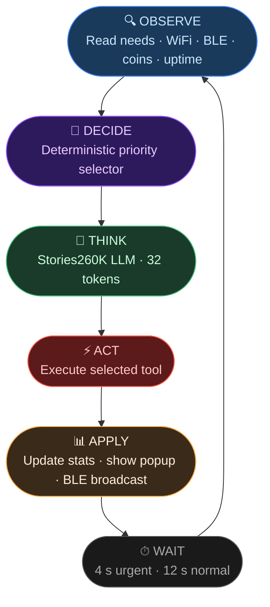

### Tool Registry & Decision Tree

The agent selects tools in strict priority order. Colors group tools by category:

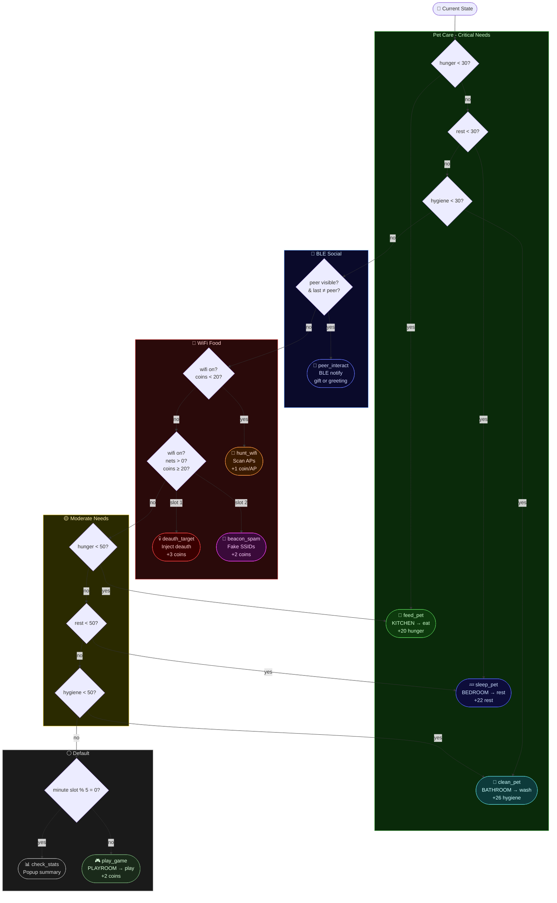

### LLM Prompt Steering

The thought hint for each tool steers the Stories260K narrative:

| Tool | LLM Flavor Hint | Example Output |
|:-----|:----------------|:---------------|
| `feed_pet` | *"so hungry, need snacks"* | *"My stomach is growling..."* |
| `sleep_pet` | *"feels tired and cozy"* | *"I just want to close my eyes~"* |
| `clean_pet` | *"wants a fresh shower"* | *"A little soap would feel nice."* |
| `hunt_wifi` | *"senses nearby signals"* | *"The air is full of packets today."* |
| `deauth_target` | *"notices a crowded network"* | *"That AP looks very busy..."* |
| `beacon_spam` | *"dreams of imaginary networks"* | *"So many SSIDs, real or not."* |
| `peer_interact` | *"senses a nearby friend"* | *"Someone is broadcasting nearby!"* |
| `check_stats` | *"checks how she is doing"* | *"Time to take stock of things."* |
| `play_game` | *"wants to play"* | *"Let's make this more fun!"* |

### WiFi Food Attack Chain

```mermaid
sequenceDiagram
    participant AG as 🤖 Agent
    participant WF as 📶 WiFi Radio
    participant AP as 📡 Access Point
    participant CL as 📱 Client

    rect rgb(20, 40, 20)
    Note over AG,WF: Phase 1,hunt_wifi (earn coins)
    AG->>WF: esp_wifi_scan_start()
    WF-->>AG: AP list (BSSID · SSID · RSSI · channel · enc)
    AG->>AG: +1 coin per AP (max 10)
    end

    rect rgb(40, 10, 10)
    Note over AG,CL: Phase 2,deauth_target (force reconnect)
    AG->>WF: esp_wifi_80211_tx(deauth frame)
    WF->>CL: 802.11 Deauth (reason: 0x01)
    CL->>AP: Reassociation request
    AP->>CL: Reassociation response
    end

    rect rgb(10, 10, 40)
    Note over AG,CL: Phase 3,passive handshake capture
    AP->>CL: EAPOL M1 (ANonce)
    CL->>AP: EAPOL M2 (SNonce + MIC)
    AG-->>AG: ✅ M1+M2 captured → hc22000 export
    end

    rect rgb(30, 10, 30)
    Note over AG,AP: Optional,beacon_spam
    AG->>WF: esp_wifi_80211_tx(fake beacon × N)
    WF->>AP: Fake SSID broadcast
    AG->>AG: +2 coins earned
    end
```

### IDF Source Files

| File | Role |
|:-----|:-----|
| `main/agent_tools.h` | Tool enum, `agent_state_t`, `tool_result_t`, `agent_decide_tool()`, `tool_thought_hint()` |
| `main/app_main.c` | Full ReAct loop in `agent_task()`, all 9 tool implementations, `app_main()` |
| `main/ble_bridge.h/.c` | BLE advertising/scanning bridge used by `peer_interact` tool |
| `main/llm.h/.c` | llama2.c-based Stories260K inference engine |

---

## 💜 Social Memory & Bond System

Every Tamagotchi remembers the peers it has met. Relationships evolve over repeated encounters, chats, and gift exchanges, persisting across reboots in NVS flash (Arduino) and localStorage (simulator).

### Bond Progression

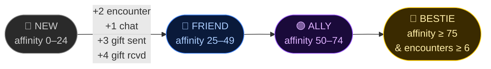

### Gift System Flow

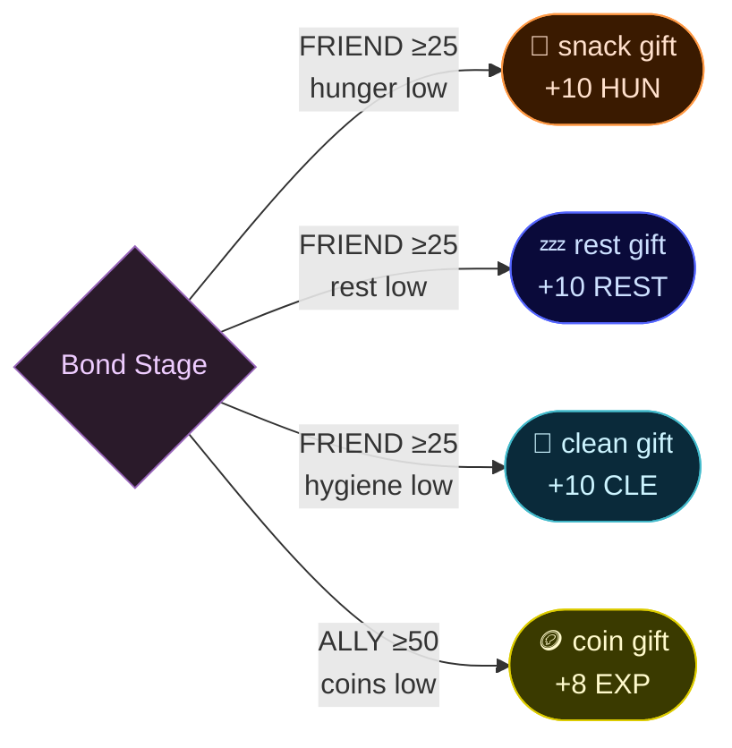

### BLE Message Flow (Device-to-Device)

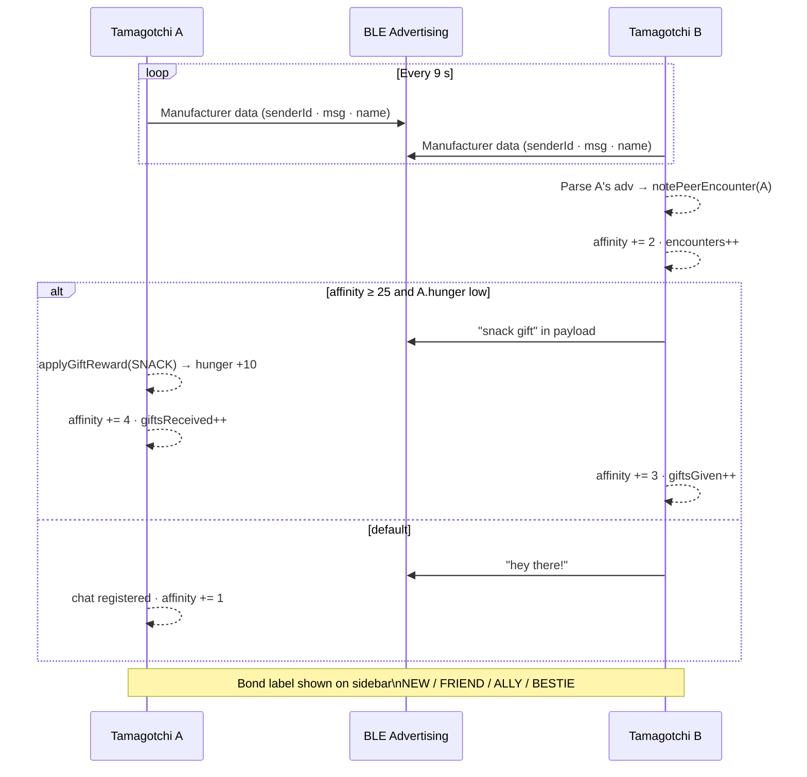

### NVS Persistence (Arduino)

Social memory is serialized to NVS as compact JSON via ArduinoJson:

```cpp
// NVS key: "peer_mem"  (config.h: NVS_SOCIAL_MEMORY)
// Max peers: 6         (config.h: MAX_SOCIAL_PEERS)
{
  "peers": [
    {
      "id": 12345,
      "name": "Sablina-7F2A",
      "enc": 8,           // encounters
      "cht": 3,           // chats
      "aff": 34,          // affinity → FRIEND stage
      "gGiven": 1,
      "gRcvd": 2,
      "lastGift": "snack"
    }
  ]
}
```

---

---

## 📱 Telegram Bot

Control and chat with Sablina remotely from your phone using **Telegram inline keyboards**,no slash commands needed, everything is a button. The bot integrates with any **OpenAI-compatible LLM API** for free-text chat and the AI WiFi Advisor feature.

---

### Menu Flow

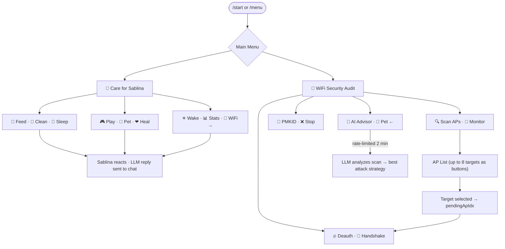

---

### Inline Keyboard Layout

```
┌─────────────────── Pet Menu ───────────────────┐
│  🍜 Feed     🛁 Clean    🌙 Sleep              │
│  🎮 Play     💜 Pet      ❤ Heal                │
│  ☀ Wake     📊 Stats    📡 WiFi Audit →        │
└─────────────────────────────────────────────────┘

┌─────────────────── WiFi Menu ──────────────────┐
│  🔍 Scan APs        📡 Monitor                 │
│  🔥 Deauth          🤝 Handshake               │
│  🔑 PMKID           ❌ Stop                    │
│  🤖 AI Advisor      🐾 Pet Menu ←              │
└─────────────────────────────────────────────────┘

┌──── AP Picker (appears after Scan) ────────────┐
│  HomeNet -65dBm     CafeWifi -72dBm            │
│  HiddenNet -80dBm   Office_5G -55dBm           │
│  ← Back                                        │
└─────────────────────────────────────────────────┘
```

---

### AI WiFi Advisor

The **AI Advisor** button sends the current scan results to the LLM and asks for a tactical recommendation. Calls are **rate-limited to once every 2 minutes** to avoid exhausting API quotas.

```
🤖 AI Advisor:
Strongest target: "HomeNet" (ch6, -65 dBm, WPA2, 3 clients).
With active clients → run Deauth + Handshake capture.
"CafeWifi" has no clients detected → try PMKID (clientless).
Prioritize high-signal targets with the most active stations.
```

---

### Push Alerts

When hunger / fatigue / cleanliness drops to critical, Sablina messages you proactively (5-minute cooldown between alerts):

```
🍜 Sablina is STARVING! (hunger 12%)
[🍜 Feed]  [🛁 Clean]  [🌙 Sleep]
[🎮 Play]  [💜 Pet]    [❤ Heal]
[☀ Wake]  [📊 Stats]  [📡 WiFi]
```

---

### LLM Backend Options

The bot uses an **OpenAI-compatible `/chat/completions` endpoint**. Any of the following work out of the box:

| Provider | Endpoint | Notes |
|---|---|---|
| **[OpenWebUI](https://github.com/open-webui/open-webui)** | `http://your-server:3000/api/chat/completions` | Self-hosted, supports Ollama + OpenAI models |
| **[Ollama](https://ollama.com/)** | `http://your-server:11434/v1/chat/completions` | Local, free, no API key needed |
| **[OpenAI](https://platform.openai.com/)** | `https://api.openai.com/v1/chat/completions` | GPT-4o, GPT-4o-mini |
| **[Groq](https://console.groq.com/)** | `https://api.groq.com/openai/v1/chat/completions` | Fast inference, generous free tier |
| **[Together AI](https://www.together.ai/)** | `https://api.together.xyz/v1/chat/completions` | Open-source models |
| **[LM Studio](https://lmstudio.ai/)** | `http://localhost:1234/v1/chat/completions` | Local GUI, one-click model switching |
| **Any OpenAI-compat API** | your endpoint | Set `TG_OPENWEBUI_ENDPOINT_DEFAULT` |

> **Recommended for self-hosting:** [OpenWebUI](https://github.com/open-webui/open-webui),one Docker command, runs on any machine on your LAN, proxies Ollama or remote models transparently.

```bash
# Quick start,OpenWebUI + Ollama
docker run -d -p 3000:8080 \
  --add-host=host.docker.internal:host-gateway \
  -v open-webui:/app/backend/data \
  ghcr.io/open-webui/open-webui:main
```

---

### Setup

```c
// SablinaTamagotchi_2.0/secrets.h 
#define TG_BOT_TOKEN_DEFAULT          "YOUR_BOT_TOKEN"          // from @BotFather
#define TG_OPENWEBUI_KEY_DEFAULT      "sk-..."                   // API key (or empty for Ollama)
#define TG_OPENWEBUI_ENDPOINT_DEFAULT "https://your-host/api/chat/completions"
#define TG_OPENWEBUI_MODEL_DEFAULT    "llama3.2:3b"              // any model your server serves
```

1. Create a bot with [@BotFather](https://t.me/BotFather) → copy the token
2. Fill in `secrets.h` with your chosen LLM backend (see table above)
3. Flash the firmware,`secrets.h` is never compiled into the repo
4. Send `/start` to the bot,it auto-registers your `chat_id` from the first message

---

### Integration Architecture

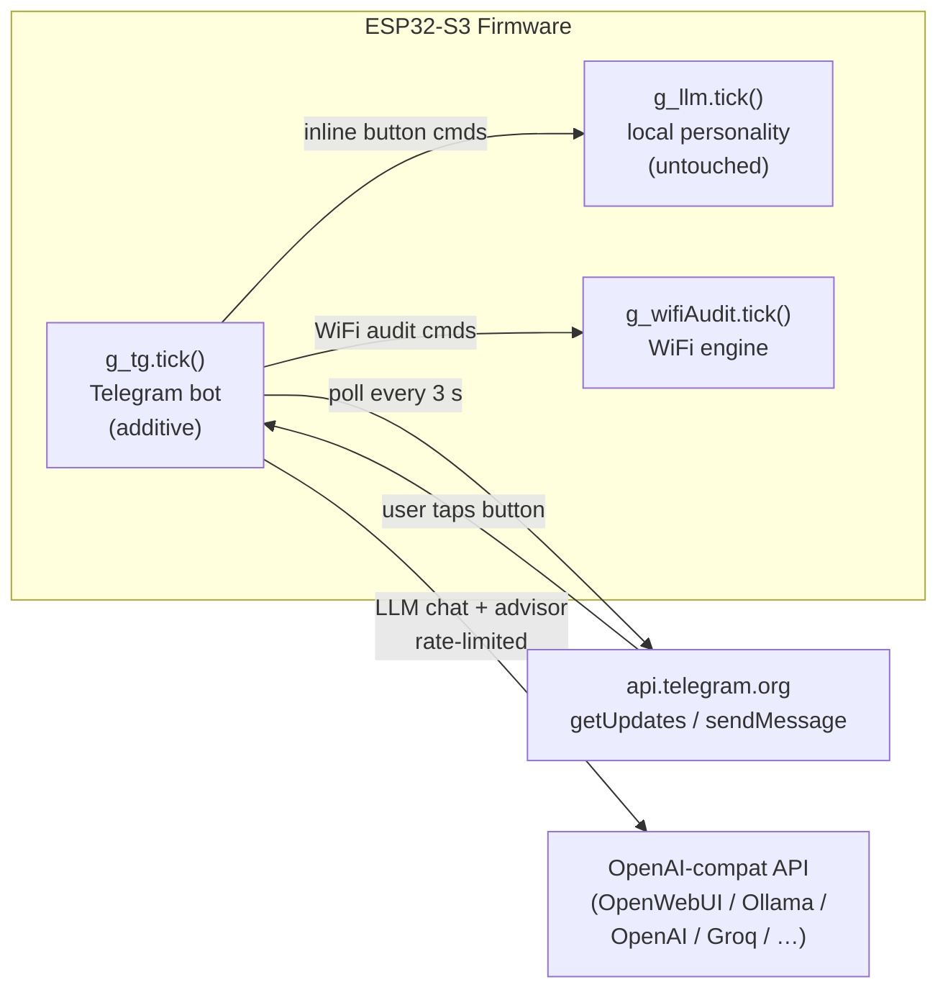

---


## 🏗 Architecture

### System Overview

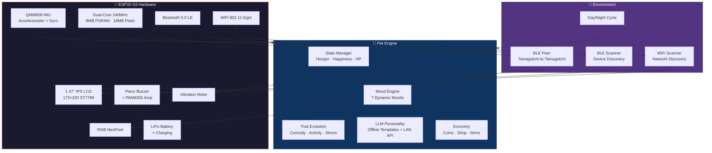

### Pet State Machine

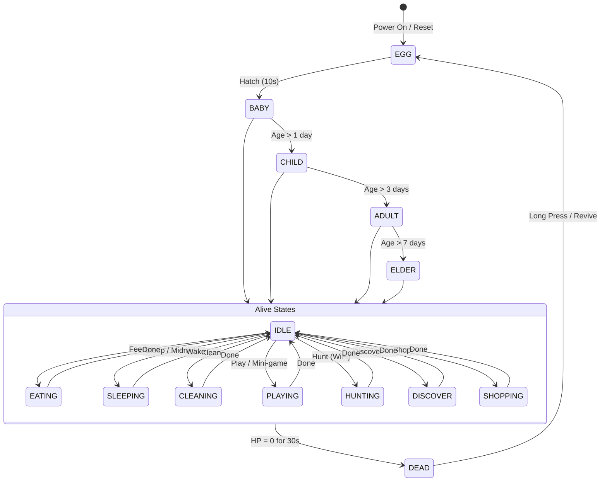

### Screen Navigation

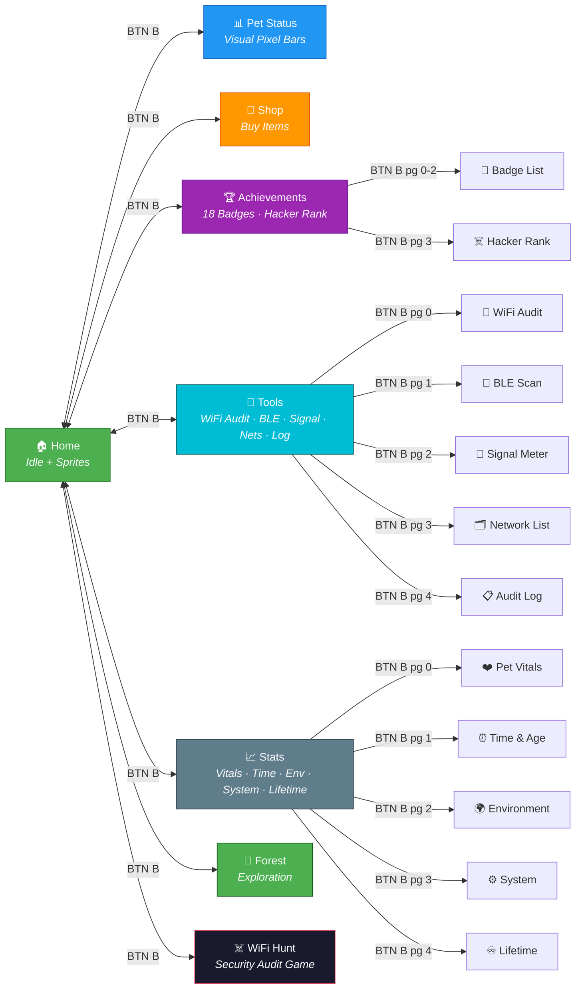

### BLE Peer Interaction Flow

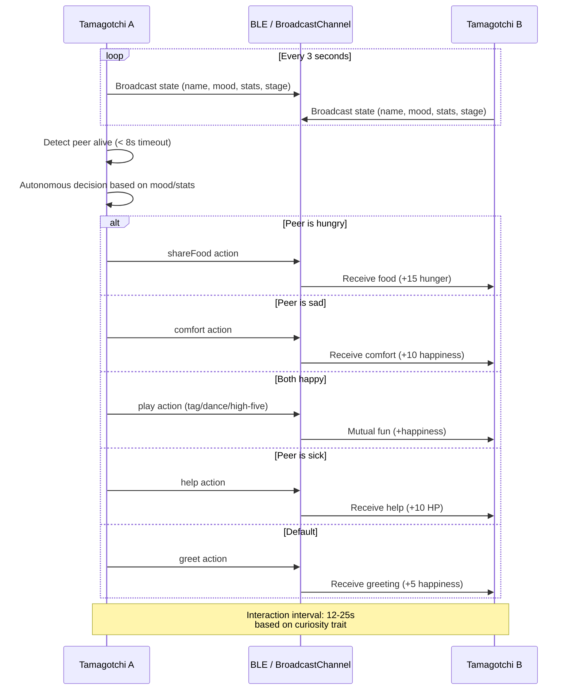

---

## ✨ Features

### ☠️ WiFi Security Audit
- **Deauthentication**, Raw 802.11 frame injection via `esp_wifi_80211_tx()`, targeted or broadcast
- **WPA Handshake Capture**, EAPOL 4-way handshake parser captures M1+M2 in promiscuous mode
- **PMKID Extraction**, Clientless attack via RSN Information Element parsing
- **Channel hopping**, Automatic channel rotation across 1-13 for passive discovery
- **AP discovery**, SSID, BSSID, channel, RSSI, encryption type (Open/WEP/WPA/WPA2/WPA3)
- **Client tracking**, Associates clients to APs from probe/data frames
- **hc22000 export**, Hashcat-compatible output for offline password cracking

### 🤖 ReAct Hybrid Agent (ESP-IDF)
- **Full on-device agent loop**, Observe → Think (LLM) → Decide (deterministic) → Act → repeat every 4–12 s
- **9 callable tools**, `feed_pet`, `sleep_pet`, `clean_pet`, `play_game`, `hunt_wifi`, `deauth_target`, `beacon_spam`, `check_stats`, `peer_interact`
- **LLM flavor text**, Stories260K (260K parameters) generates a personality-colored thought per cycle (~32 tokens)
- **Deterministic selector**, Tool choice is priority-based: critical needs → BLE peer → WiFi Food → moderate needs → play/stats
- **Urgent fast-loop**, Cycle period drops from 12 s to 4 s when any need is critical (< 30)
- **BLE broadcast per cycle**, Compact state string (`tool|HxRxCx$coins`) sent to nearby peers after each action
- **Simulator parity**, Browser simulator runs an identical `runAgentReActStep()` loop with simulated LLM thoughts

### 💜 Social Memory & Bonds
- **Persistent peer relationships**, Each device remembers up to 6 peers (NVS JSON, Arduino) / displayed in sidebar
- **Four bond stages**, NEW → FRIEND → ALLY → BESTIE based on affinity score and encounter count
- **Gift mechanics**, Bond-aware gifts (snack/rest/clean/coin) sent automatically when peer need is low and affinity allows
- **Affinity system**, +2 encounter / +1 chat / +3 gift sent / +4 gift received
- **Cross-reboot persistence**, Social memory survives power cycles via `Preferences` NVS (Arduino) / `localStorage` (simulator)

### 🐣 Core Pet Simulation
- **Life stages**, Egg → Baby → Child → Adult → Elder with hatching animation
- **Needs system**, Hunger, Happiness, and Health stats with autonomous decay
- **Death & revival**, Pet dies if HP reaches zero for 30 seconds; long-press to revive
- **Dynamic mood**, 7 moods (Happy, Excited, Hungry, Sick, Bored, Curious, Sleepy) derived from stats + environment
- **Coin economy**, Earn from WiFi discoveries, BLE encounters, mini-games, and passive bonuses
- **Trait evolution**, Curiosity, Activity, and Stress traits evolve based on behavior patterns

### 📡 Environment Awareness
- **WiFi scanning**, Detects nearby networks; count influences mood and coin income
- **BLE scanning**, Discovers Bluetooth devices; affects mood and curiosity trait
- **Day/night cycle**, Visual tint at night; pet auto-sleeps after midnight
- **BLE peer interaction**, Two Tamagotchis discover each other and autonomously share food, play, comfort, and explore

### 🎮 Interactions
- **Feed, Clean, Sleep, Pet, Shake**, Standard care commands with stat effects and sound
- **Hunt**, Scan WiFi networks to earn food and coins
- **Discover**, Garden exploration for items and coins
- **Mini-game**, "Catch the Signal", 5-round timing game earning coins and happiness
- **Shop**, Purchase items with coins (sushi, clothing, accessories)

### � Hardware Feedback
- **Audio**, 11 sound effects via piezo buzzer (feed, clean, play, sleep, death, hatch, coin, warnings, etc.)
- **Haptic**, Vibration motor pulses on pet/shake actions, warnings, death, and BLE events
- **NeoPixel LED**, Mood-colored RGB glow reflecting current emotional state
- **Visual indicators**, On-screen speaker icon (sound) and pulsing border (vibration) feedback

### 🧠 LLM Personality
- **Offline-first**, Autonomous personality engine generates context-aware thoughts without network
- **Template system**, Mood-specific, activity-specific, and environment-aware narrative templates
- **Optional LAN endpoint**, Connect to Ollama/LM Studio for richer AI-generated responses
- **On-device inference**, TinyStories 260K model runs directly on ESP32-S3 (ESP-IDF variant)

### 📱 Telegram Bot
- **Interactive inline keyboards**, Full control panel with tap-to-use buttons,no slash commands needed
- **Pet care menu**, Feed / Clean / Sleep / Play / Pet / Heal / Wake,each triggers the exact same reaction as physical buttons
- **WiFi audit menu**, Scan / Monitor / Deauth / Handshake / PMKID / Stop,full WiFi Food control from your phone
- **AP picker**, After scanning, lists discovered APs as tappable buttons to select a deauth/handshake target
- **AI WiFi Advisor**, Rate-limited LLM call that analyzes scan results and recommends the best attack strategy
- **Live stats panel**, Vitals with ASCII progress bars delivered as inline keyboard with care shortcuts
- **Push alerts**, Proactive notifications when hunger/fatigue/cleanliness drop to critical levels (5-min cooldown)
- **LLM chat**, Free-text conversation,Sablina replies in character via any OpenAI-compatible API (OpenWebUI, Ollama, OpenAI, Groq…)
- **Auto-learn chat_id**, First user to message the bot is automatically registered as owner
- **Persistent offset**, `update_id` stored in NVS to prevent message replay after reboot

### 🖥 Display & Navigation
- **172×320 IPS LCD** (ST7789) with 65 animated pixel-art sprites
- **2-button navigation**, BTN B cycles screens, BTN A selects, long-press A returns home
- **9 screens**, Home, Pet Status (visual pixel bars), Shop, Achievements, Tools, Stats, Forest, WiFi Hunt, plus legacy ENV/SYS redirect to Stats
- **Achievements**, 4 pages: 18 collectible badges (pg 0-2) + Hacker Rank card with 5 tiers (pg 3)
- **Tools**, 5 pages: WiFi Audit, BLE Scan (animated pulse), Signal Meter (animated bars), Network List (discovered APs with signal strength), Audit Log (timestamped capture events)
- **Stats**, 5 pages: Pet Vitals (pixel-bar visualizations), Time & Age, Environment, System, Lifetime totals
- **Auto-hiding icons**, Action icons appear on home screen and fade after inactivity
- **Notification bubbles**, LLM thoughts and events as floating overlays
- **Battery management**, LiPo charging with drain simulation based on radio usage
- **Dark mode**, Reduced brightness for low-light environments

---

## 📸 Simulator Screenshots

<div align="center">

| Home Screen | Pet Status | Shop |
|:-:|:-:|:-:|
| 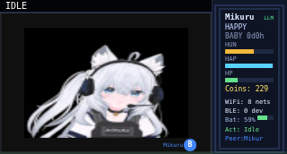 | 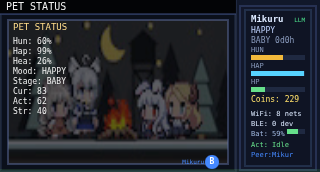 | 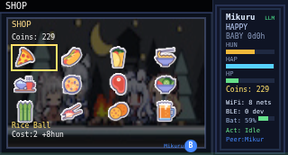 |

| Environment | Forest | System |
|:-:|:-:|:-:|
| 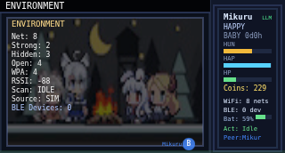 | 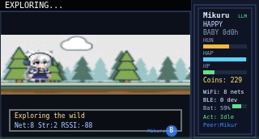 | 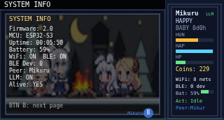 |

</div>

---

## 🔧 Hardware

### Main Board

**ESP32-S3 1.47" IPS LCD Development Board**

| Spec | Detail |
|:-----|:-------|
| **MCU** | ESP32-S3 dual-core 240 MHz, WiFi + BLE 5.0 |
| **Display** | 1.47" IPS LCD, 172×320, ST7789 driver |
| **Memory** | 8 MB PSRAM, 16 MB Flash |
| **IMU** | QMI8658 6-axis (accelerometer + gyroscope) |
| **LED** | Onboard RGB NeoPixel |
| **Storage** | MicroSD card slot |
| **Battery** | JST connector with onboard charging circuit |
| **Interface** | USB-C, boot/reset buttons |

### Additional Components

| Component | Description |
|:----------|:------------|
| **LiPo Battery** | 3.7V 1000mAh lithium polymer cell, JST PH connector |
| **Audio Amplifier** | PAM8302 mono 2.5W Class-D amplifier breakout |
| **Buzzer** | Piezoelectric buzzer, 20mm copper disc with wire leads |
| **Vibration Motor** | DC coin-type vibration motor, 10mm × 2.7mm, 3V |
| **Enclosure** | 3D-printed case (PLA filament), STL files in `3D_Printing/` |

### Wiring

| Signal | ESP32-S3 GPIO | Component |
|:-------|:--------------|:----------|
| Speaker | `SPEAKER_PIN` in `config.h` | PAM8302 input → buzzer |
| Vibration | `VIBRO_PIN` in `config.h` | Motor via NPN transistor |
| Battery | Onboard JST | LiPo cell |
| IMU | I2C (onboard) | QMI8658 |
| LCD | SPI (onboard) | ST7789 |
| NeoPixel | Onboard GPIO | RGB LED |

---

## 📁 Project Structure

```
Sablina_Tamagotchi_ESP32/
├── SablinaTamagotchi_2.0/            # Arduino firmware (v2.0)
│   ├── SablinaTamagotchi.ino         # Main sketch (~5100 lines)
│   ├── config.h                     # Pin assignments, feature flags, LLM config
│   ├── wifi_audit.h                 # WiFi security audit module (deauth/handshake/PMKID)
│   ├── ble_service.h                # BLE GATT service
│   ├── imu_handler.h                # QMI8658 accelerometer/gyroscope
│   ├── llm_personality.h            # Offline LLM personality engine
│   └── *.h                          # Sprite data (65 bitmap arrays)
│
├── SablinaTamagotchi_2.0_idf/        # ESP-IDF variant,on-device LLM + ReAct Agent
│   ├── data/                        # Model binaries (stories260K.bin, tok512.bin)
│   ├── main/
│   │   ├── app_main.c               # Full ReAct agent_task() + all tool implementations
│   │   ├── agent_tools.h            # Tool enum, agent_state_t, tool_result_t, selector
│   │   ├── ble_bridge.h/.c          # BLE advertising/scanning peer bridge
│   │   ├── llm.h/.c                 # llama2.c Stories260K inference engine
│   │   └── llama.h                  # Architecture types
│   ├── CMakeLists.txt
│   └── partitions.csv
│
├── simulator/                       # Browser-based development simulator
│   ├── index.html                   # UI layout with audit controls
│   ├── app.js                       # Full simulation engine (~3500 lines)
│   ├── sprites.js                   # All 65 sprites as pixel data
│   ├── style.css                    # Styling
│   ├── wifi-scan-server.js          # Optional local WiFi scan proxy
│   └── tools/                       # Sprite conversion utilities
│
├── third_party/esp32-llm/           # Vendored esp32-llm by DaveBben
├── 3D_Printing/                     # STL files for enclosure
├── Photos/                          # Build photos & simulator screenshots
└── tools/                           # Helper scripts
```

---

## 🖥 Simulator

The browser simulator replicates the full device behavior for rapid development without hardware.

### Quick Start

```bash
# Serve from the repository root
python3 -m http.server 8080

# Open in browser
xdg-open http://localhost:8080/simulator/
```

### Optional: Real WiFi Scanning

Feed live WiFi scan data into the simulator:

```bash
cd simulator
node wifi-scan-server.js
```

Then enable the **"Real WiFi"** checkbox in the simulator control panel.

### Simulator Controls

| Control | Action |
|:--------|:-------|
| **BTN A** | Select / Tap (mini-game) / Long press = Home / Revive |
| **BTN B** | Cycle to next screen (or next page within ACHIEVEMENTS/TOOLS/STATS) |
| **Sidebar sliders** | Adjust stats (hunger, happiness, HP) in real-time |
| **Checkboxes** | Toggle WiFi, BLE, Dark Mode, Charging |
| **Screen buttons** | Direct navigation to any screen (Status, Shop, Achieve, Tools, Stats, Forest, WiFi Hunt) |
| **Action buttons** | Feed, Sleep, Clean, Play, Pet, Shake, Hunt, Discover |
| **Audit buttons** | Scan APs, Monitor, Deauth, Capture HS, PMKID, Stop |
| **Zoom bar** | Resize the canvas, Full / Large / Medium / Small / Real (118px, actual device size) |

### Simulator Feature Parity

The simulator covers **all** device features:

| Feature | Status |
|:--------|:------:|
| Autonomous engine (mood, activity, stat decay) | ✅ |
| All 65 animated sprites with frame cycling | ✅ |
| WiFi security audit simulation (scan/deauth/HS/PMKID) | ✅ |
| WiFi and BLE environment simulation | ✅ |
| BLE peer-to-peer interaction (via BroadcastChannel) | ✅ |
| Social memory & bond system (NEW/FRIEND/ALLY/BESTIE) | ✅ |
| Persistent bond display in info panel | ✅ |
| Gift mechanics (snack/rest/clean/coin) via BLE | ✅ |
| ReAct Hybrid Agent loop (Observe→Think→Decide→Act) | ✅ |
| Agent tool dispatcher (9 tools) | ✅ |
| Agent state display in info panel (AI: tool #N) | ✅ |
| LLM personality engine | ✅ |
| Mini-game ("Catch the Signal") | ✅ |
| Egg hatching and death/revival | ✅ |
| Battery drain and charging | ✅ |
| Audio via Web Audio API | ✅ |
| Visual vibration effect | ✅ |
| NeoPixel mood glow | ✅ |
| Day/night overlay | ✅ |
| Dark mode | ✅ |
| Persistent state (localStorage) | ✅ |
| Project editor (sprite gallery + flash counter) | ✅ |
| Achievements screen (18 badges, 4 pages) | ✅ |
| Hacker Rank card (SCRIPT KIDDIE → ELITE HACKER) | ✅ |
| Tools screen, Network List (discovered APs, signal bars) | ✅ |
| Tools screen, Audit Log (timestamped HS/PMKID/DEAUTH/SCAN events) | ✅ |
| Tools screen, Animated Signal Meter (live wave bars) | ✅ |
| Stats screen, Lifetime totals (food, caps, games, coins) | ✅ |
| Pet Status, Visual pixel bars for all vitals & traits | ✅ |
| Canvas zoom bar (Full / Large / Medium / Small / Real size) | ✅ |

### BLE Peer Simulation

Open two browser tabs at the same URL. Each tab becomes a separate Tamagotchi instance that discovers the other via `BroadcastChannel`. Pets autonomously interact based on their mood and stats, sharing food when hungry, playing when happy, comforting when sad.

---

## 🧠 ESP32 + LLM

### Architecture Options

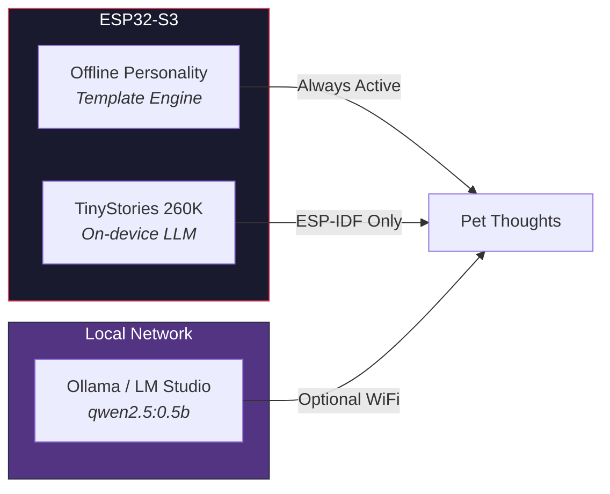

| Tier | Description | Requirements |
|:-----|:------------|:-------------|
| **Offline Templates** | Context-aware thoughts from mood/activity/environment templates | None (always active) |
| **LAN Endpoint** | Rich AI responses from a local LLM server | WiFi + Ollama/LM Studio on LAN |
| **On-Device** | TinyStories 260K model runs on ESP32-S3 | ESP-IDF build, model files in `data/` |

### LAN Endpoint Configuration

Set in `SablinaTamagotchi_2.0/config.h`:

```cpp
// LLM Configuration
#define LLM_ENDPOINT  "http://<your-lan-ip>:11434/v1/chat/completions"
#define LLM_MODEL     "qwen2.5:0.5b"
#define LLM_KEY       ""  // Empty for local Ollama
```

> **Recommended model:** `qwen2.5:0.5b` (~398 MB quantized), fast enough for short pet replies.

### ESP-IDF On-Device Inference

The `SablinaTamagotchi_2.0_idf/` variant runs TinyStories directly on the ESP32:

```bash
cd SablinaTamagotchi_2.0_idf
idf.py set-target esp32s3
idf.py build flash monitor
```

Model files: `data/stories260K.bin`, `data/tok512.bin`

---

## 🔨 Building the Firmware

### Arduino (v2.0)

1. Install [Arduino IDE](https://www.arduino.cc/en/software) with ESP32 board support
2. Select board: **ESP32S3 Dev Module**
3. Configure:
   - Flash Size: **16 MB**
   - PSRAM: **8 MB OPI**
4. **Create your credentials file** (Telegram bot + OpenWebUI API key):
   ```bash
   cd SablinaTamagotchi_2.0
   cp secrets.h.example secrets.h
   # edit secrets.h with your bot token and API key
   ```
5. Open `SablinaTamagotchi_2.0/SablinaTamagotchi.ino`
6. Upload

### ESP-IDF (with On-Device LLM)

1. Install [ESP-IDF v5.x](https://docs.espressif.com/projects/esp-idf/en/stable/esp32s3/get-started/)
2. Build and flash:

```bash
cd SablinaTamagotchi_2.0_idf
idf.py set-target esp32s3
idf.py build flash monitor
```

---

## 🖨 3D Printed Enclosure

<p align="center">
  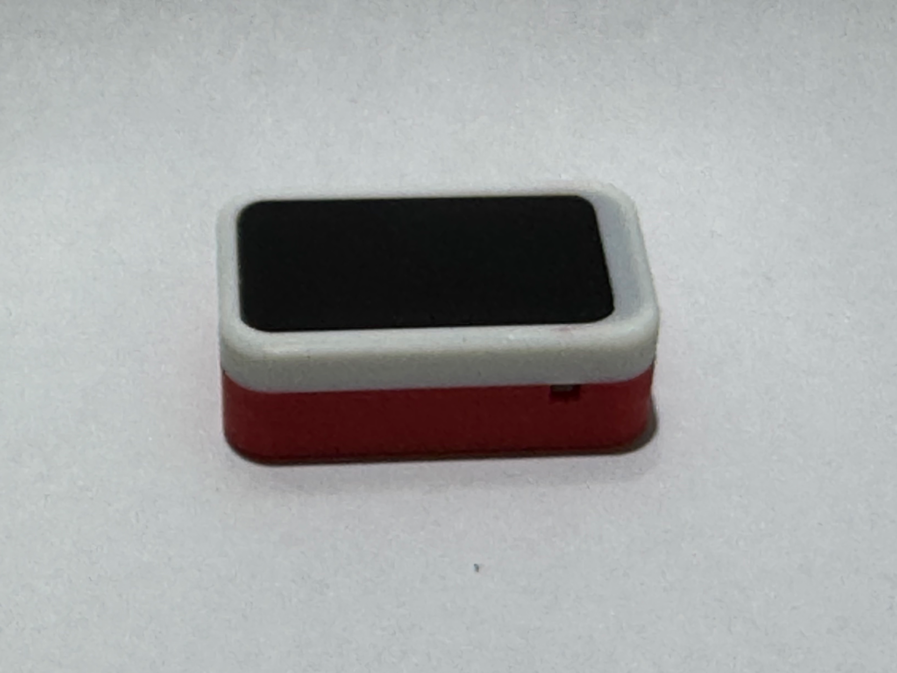
</p>

The enclosure is designed for the **ESP32 1.47″ LCD** form factor.

| File | Format | Description |
|---|---|---|
| `Gehäuse.stl` | STL | Print-ready mesh |
| `Gehäuse.step` | STEP | Editable CAD source |

> **Design credit:** [ESP32 LCD 1.47 Case](https://makerworld.com/en/models/1301018-esp32-lcd-1-47-case#profileId-1333349) on MakerWorld. If you print or remix this enclosure, please credit the original designer.

## ⚖️ Legal & Security

> This project includes active 802.11 security tools. Use them only on networks you own or have explicit written authorisation to test.

- 📄 [DISCLAIMER.md](DISCLAIMER.md), Full legal disclaimer, UK/EU/US law references, responsible-use checklist
- 🔒 [SECURITY.md](SECURITY.md), Vulnerability disclosure policy, in-scope areas, credential handling, safe harbour

---

## 📜 Credits & License

### Original Project

This project is a fork of the original Mikuru Tamagotchi by **[MikuruM](https://github.com/MikuruM/Mikuru_Tamagotchi_ESP32)**, extended with WiFi security auditing, LLM personality, BLE peer interaction, and a full browser simulator.

### Mini LLM (260k)

- **esp32-llm** by [DaveBben](https://github.com/DaveBben/esp32-llm), On-device TinyStories inference engine

### Inspiration

- **[Pwnagotchi](https://pwnagotchi.ai/)**, The original WiFi-auditing virtual pet (Raspberry Pi based)

### License

This project is licensed under the **GNU General Public License v2.0**, see [LICENSE](LICENSE) for details.

All original sprites from MikuruM's project are redistributed under the same GPL v2.0 license.
